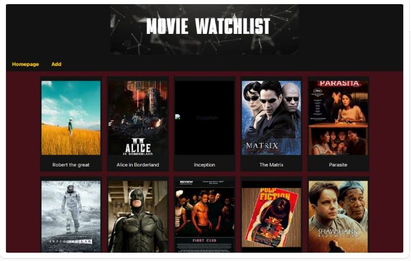

# Movie Watchlist



## Hoisted Link

https://movie-watch-list-khaki.vercel.app/

## Description

This is a Movie Watchlist application where you can add movies to your watchlist and view detailed information about each movie.

## Features

- Add movies to your watchlist.
- View detailed information about each movie.

## State Management

The application uses **Redux** for state management, ensuring a centralized and predictable way to manage application state.

## Getting Started

### Prerequisites

- [Node.js](https://nodejs.org/en/) (v12 or higher)
- [npm](https://www.npmjs.com/) (v6 or higher) or [yarn](https://yarnpkg.com/) (v1.22 or higher)

### Installation

1. Clone the repository:

   ```sh
   git clone https://github.com/Symits54321/Movie_WatchList.git
