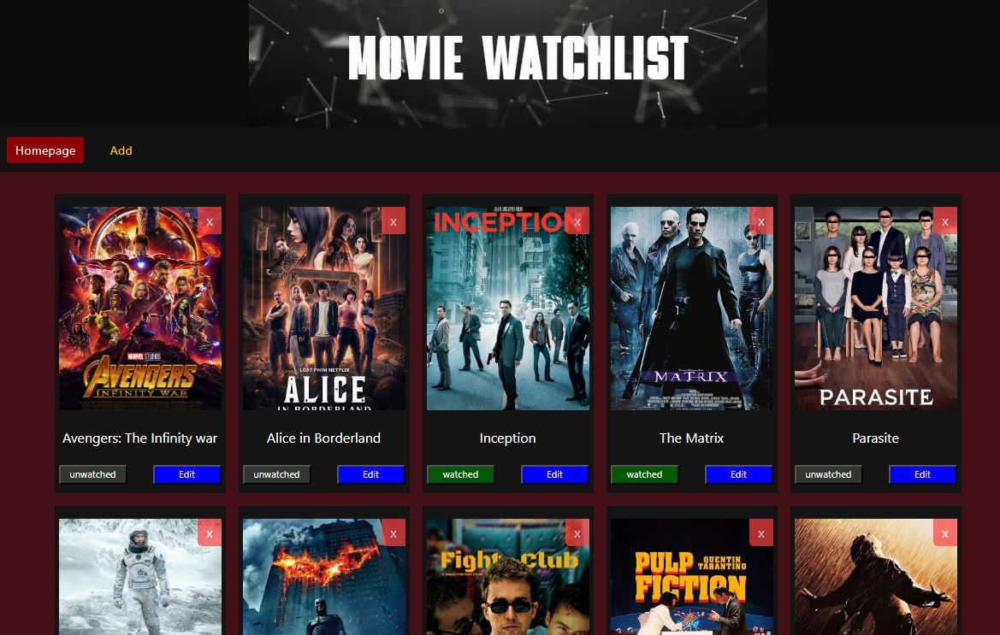

# Movie Watchlist




## Hoisted Link

https://movie-watch-list-khaki.vercel.app/


## Description

This is a Movie Watchlist application where you can add,edit,delete movies and view detailed information about each movie.


## Features

- Youtube-video pane on detailpage (by Youtube_React Library)

   


- Add movies.

  


- Edit movies.

<<<<<<< HEAD
   
=======
   
>>>>>>> 845ccc9a551896485cdb84b1934addcced9e9eb9


- Delete movies .

- View detailed information about each movie.


## State Management

The application uses **Redux** for state management, ensuring a centralized and predictable way to manage application state.


### Installation

1. Clone the repository:

   ```sh
   git clone https://github.com/Symits54321/Movie_WatchList.git
